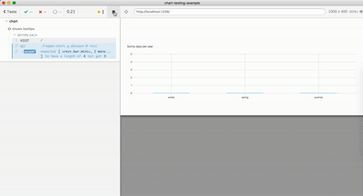

# chart-testing-example  [![renovate-app badge][renovate-badge]][renovate-app]

> Testing an SVG chart using Cypress.io test runner

See [cypress/integration/spec.js](cypress/integration/spec.js)

Application is in [index.html](index.html) and [app.js](app.js).

Tests in [cypress/integration](cypress/integration) folder show:

- [first-spec.js](cypress/integration/first-spec.js) shows initial chart load test
- [tooltip-spec.js](cypress/integration/tooltip-spec.js) tests how a tooltip appears and disappears
- [seasons-spec.js](cypress/integration/seasons-spec.js) tests that each bar has a label in tooltip
- [labels-spec.js](cypress/integration/labels-spec.js) shows how to share the list of labels between the application and the test
- [visual-diff-spec.js](cypress/integration/visual-diff-spec.js) uses [Applitools Cypress plugin](https://github.com/applitools/eyes-cypress) to visually check the chart during the test

[renovate-badge]: https://img.shields.io/badge/renovate-app-blue.svg
[renovate-app]: https://renovateapp.com/
